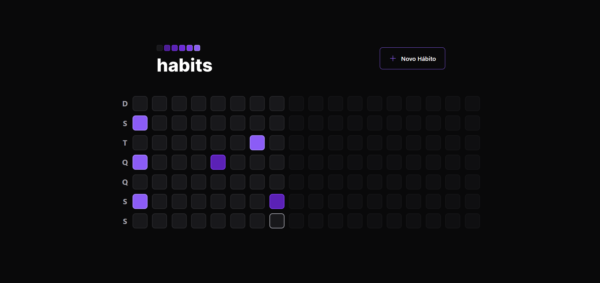
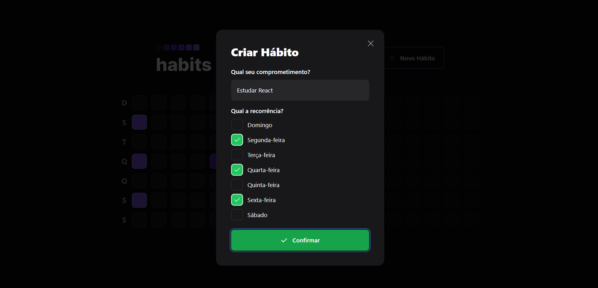
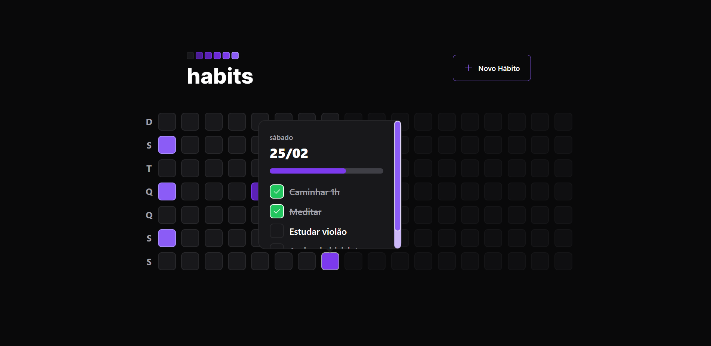

<p align="center">
  
</p>
<h3 align="center">
Você no controle da sua rotina 🚀
</h3>

<br>

<p align="center">
  
   
  
</p>
<br>

<p align="center">
  <a href="#sobre">Sobre</a> •
  <a href="#habits">Habits</a> •
  <a href="#instalação">Instalação</a> •
  <a href="#tecnologias">Tecnologias</a> 
</p>

## Sobre

Projeto desenvolvido durante o primeiro NLW de 2023 realizado pela Rocketseat. Teve como objetivo desenvolver uma aplicação completa em NodeJS + ReactJS.

## Habits

O Habits é um app para monitoramento de tarefas diárias para auxiliar seus usuários a rastrear suas atividades realizadas e não realizadas.

O fluxo da aplicação é simples: o usuário cadastra os hábitos desejados indicando em quais dias da semana deverão ser realizados e todos os dias ele terá uma listas de hábitos de acordo com o dia atual, o qual ele irá indicar o status de cada hábito e a aplicação irá gerar um progresso diário que será ilustrado na barra de progresso, ou seja por meio das cores dos quadrados que representam os dias e, por meio de uma escala de cores, quanto mais hábitos forem concluídos para aquele dia específico, mais forte a cor fica.

### Habits - Aplicação web

Ao acessar a aplicação web, o usuário irá se deparar com a página abaixo aonde será exibido um botão para cadastro de um novo hábito e vários quadrados os quais representam dias passados, dia atual e dia futuro. Como podemos ver a seguir, cada dia possui uma cor diferente:

- Cinza indica que nenhum hábito foi realizado.
- Cores mais escuras indicam pouco progresso nos hábitos diários.
- Cores mais claras indicam muito progresso nos hábitos diários.
- Cinza com opacidade reduzida indica dias futuros e não são clicáveis.
- O dia atual estará com uma borda clara.



Ao clicar no botão `Novo hábito`, o modal abaixo será exibido para o usuário inserir um título e os dias da semana em que o novo hábito deve ser realizado:



Ao clicar no quadrado que representa o dia, algumas informações serão exibidas: a data, o dia da semana, a barra de progresso e a lista de hábitos que devem ser realizados:



## Instalação

Antes de começar, você vai precisar ter instalado em sua máquina as seguintes ferramentas:
[Git](https://git-scm.com), [Node.js](https://nodejs.org/en/).
Além disso é bom ter um editor para trabalhar com o código como [VSCode](https://code.visualstudio.com/).

### 🎲 Rodando o Back End (servidor)
Acesse o repositório do backend [AQUI](https://github.com/ponqueli/nlw-habits-server).

### 🖥️ Rodando o Front End (Web)

```bash
# Clone este repositório
$ git clone https://github.com/ponqueli/nlw-habits-web.git

# Acesse a pasta do projeto no terminal/cmd
$ cd nlw-habits-web

# Instale as dependências
$ npm install

# Execute a aplicação em modo de desenvolvimento
$ npm run dev

# O servidor inciará na porta 5173 - acesse <http://localhost:5173>
```

## Tecnologias

[](https://skillicons.dev)

</div>